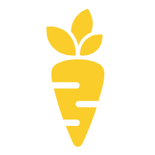

<p align="center">
  
</p>

<h1 align="center">Carrot</h1>

<p align="center">
  <strong>The bridge between AI agents and your browser.</strong>
</p>

<p align="center">
  <a href="#quick-start">Quick start</a> ·
  <a href="#security-model">Security</a> ·
  <a href="#api-reference">API</a> ·
  <a href="CONDUCT.md">Development</a> ·
  <a href="#self-hosting">Self-host</a>
</p>

---

Carrot is a Chrome extension plus a small bridge server that lets AI agents safely act in your browser through a simple HTTP and MCP API.

**Community-hosted bridge instance:** `https://browser.carrotlabs.ai`

## What It Does

- **Browser actions** — read pages, click, type, fill forms, manage tabs, take screenshots, and inspect console/network data.
- **Scope-based pairing** — 6-character codes grant time-limited access to a tab, window, or browser.
- **Activity monitoring** — the side panel shows active sessions and streams agent actions in real time.
- **MCP and HTTP APIs** — use Carrot from Cursor, Claude Desktop, scripts, or any MCP client.

## How It Works

```
┌─────────────┐         ┌──────────────────┐         ┌──────────────────┐
│  AI Agent    │  HTTP   │  Carrot Bridge   │   WS    │  Chrome Extension│
│  (Cursor,    │────────▶│  Server          │◀────────│  (your browser)  │
│   Claude,    │  /cmd   │  any instance    │  cmds   │                  │
│   scripts)   │◀────────│                  │────────▶│  executes via    │
│              │ results │                  │ results │  chrome.* APIs   │
└─────────────┘         └──────────────────┘         └──────────────────┘
```

1. **Extension** connects to the bridge server via WebSocket
2. **Agent** sends commands via `POST /cmd` with a session token
3. **Server** routes commands to the correct browser, returns results
4. **Extension** executes commands using Chrome APIs (scripting, tabs, etc.)

## Quick Start

<p align="center">
  <a href="https://github.com/carrotlabsai/carrot-browser/raw/main/carrot-browser-extension.zip">
    <kbd>Download the Chrome extension</kbd>
  </a>
</p>

Open Carrot from the Chrome toolbar, click **Pair an Agent**, and paste the
copied prompt into your agent.

The extension uses the community-hosted bridge at
`https://browser.carrotlabs.ai` by default. If you want to run it yourself, run
`server.py` locally and add that address in the extension's
**Settings -> Server URL** field.

## Security Model

Carrot uses a **pairing-code authentication** model inspired by [OAuth 2.0 Device Authorization Grant (RFC 8628)](https://www.rfc-editor.org/rfc/rfc8628), Bluetooth numeric comparison, and screen-sharing codes.

### Three-Party Trust

- **Browser extension** authenticates to the server with a `browser_id` + `browser_token` (generated once, stored locally)
- **Agents** authenticate with a **session token** obtained by claiming a pairing code
- **Users** control which agents can access their browser and with what scope

### Pairing Flow

1. User clicks "Generate Pairing Code" in the Carrot side panel
2. Selects scope: **This Tab**, **This Window**, or **All Tabs**
3. Extension requests a pairing code from the server
4. Server generates a 6-character code (valid 5 minutes, single-use)
5. User gives the code to the agent out-of-band
6. Agent calls `POST /sessions/claim` with the code
7. Server returns a session token scoped to the user's selection

### Scoped Access

| Scope | Access |
|---|---|
| `tab:<id>` | Can read, screenshot, navigate, and interact with only the specified tab. Global browser data and multi-tab/window management are blocked. |
| `window:<id>` | Can read, list, and interact with tabs only in the specified window. Browser-wide history/bookmark/download APIs are blocked. |
| `browser` | Full access to all tabs and windows |

### Session Lifecycle

- Sessions default to 8 hours TTL (configurable via `CARROT_SESSION_TTL`)
- Users can view and revoke active sessions from the side panel
- Each session is tied to one browser

## MCP Access

The bridge server exposes MCP directly at `/mcp`. This is part of `server.py`,
so every bridge instance has the same HTTP, WebSocket, and MCP surfaces when it
runs the current code.

The `mcp-server/` folder is different: it is an optional standalone MCP adapter
for clients that want to run a local stdio/SSE MCP process. It does not replace
the bridge server; it wraps any running bridge via `CARROT_BRIDGE_URL`.

### Quick MCP Setup (Cursor)

If your MCP client supports remote Streamable HTTP MCP, point it directly at
your bridge instance. For the community-hosted instance:

```json
{
  "mcpServers": {
    "carrot-browser": {
      "url": "https://browser.carrotlabs.ai/mcp"
    }
  }
}
```

The agent can then use the `claim_session` tool to pair with your browser at runtime.

#### Optional Local MCP Adapter

If your MCP client needs a local process, run the optional adapter and point it
at any bridge URL:

```json
{
  "mcpServers": {
    "carrot-browser": {
      "command": "uv",
      "args": ["--directory", "/path/to/carrot-extension/mcp-server", "run", "python", "server.py"],
      "env": {
        "CARROT_BRIDGE_URL": "http://127.0.0.1:7777"
      }
    }
  }
}
```

## API Reference

Every bridge instance serves the complete agent-facing HTTP reference at
`/api.md`. The community-hosted copy is available at
[`https://browser.carrotlabs.ai/api.md`](https://browser.carrotlabs.ai/api.md).
The notes below cover the common flow; `POST /cmd` is the canonical interface
for the full command surface.

All agent-facing endpoints require `Authorization: Bearer <token>` when auth is enabled.

### Generic Command

```
POST /cmd
{"type": "<command>", ...params}
```

Default timeout: 30s. Override with `"_timeout": 60`.

### Page Reading

| Command | Description |
|---|---|
| `readPage` | A11y tree with ref IDs for all visible elements |
| `find` | Search by text/aria-label/placeholder |
| `getPageText` | Full text extraction (up to 500k chars) |
| `query` | CSS selector query |

### Interaction

All accept `ref` (from readPage) or `selector` (CSS).

| Command | Description |
|---|---|
| `click` | Click an element |
| `hover` | Hover to trigger states/tooltips |
| `type` | Keyboard typing into an element |
| `formInput` | Set form values (select, checkbox, radio, etc.) |
| `fillContentEditable` | Rich text editors (Gmail, Slack) |
| `scroll` | Scroll page or element |
| `press` | Send keyboard key |

### Navigation

| Command | Description |
|---|---|
| `navigate` | Go to URL |
| `goBack` / `goForward` | Browser history |

### Tab & Window Management

| Command | Description |
|---|---|
| `createTab` / `closeTab` / `reloadTab` | Tab lifecycle |
| `groupTabs` / `ungroupTabs` | Tab groups |
| `createWindow` / `closeWindow` / `resizeWindow` | Window lifecycle |

### Debug

| Command | Description |
|---|---|
| `readConsole` | Console log/warn/error messages |
| `readNetwork` | Fetch/XHR requests with status codes |

### Info Endpoints (GET)

| Endpoint | Returns |
|---|---|
| `/status` | Server status, connected browsers, sessions |
| `/llms.txt` | Agent-facing service description and usage hints |
| `/tabs` | All open tabs |
| `/focused` | Active tab in last-focused window |
| `/windows` | All windows with tabs |
| `/screenshot?tabId=123` | Tab screenshot as data URL; omitting `tabId` captures the visible tab |
| `/history?q=search` | Browser history search |
| `/bookmarks?q=search` | Bookmark search |

### Session Endpoints

| Endpoint | Description |
|---|---|
| `POST /sessions/claim` | Claim a pairing code, get session token |
| `GET /sessions` | List active sessions |

## Scaling & Multi-Server Considerations

The bridge server stores all state in-memory (WebSocket connections, pairing codes, sessions, pending commands). This means **a single server instance is required** for correct operation. If you run multiple instances behind a load balancer, a browser's WebSocket may connect to instance A while an agent's HTTP/MCP request hits instance B — which has no knowledge of that browser's pairing codes or sessions.

### Future: scaling beyond a single instance

When traffic requires multiple machines, the path forward is **Redis as a shared state store**:

1. **Pairing codes & sessions** → Redis keys with TTL (simple key-value, already has expiry semantics)
2. **Pending commands** → Redis pub/sub to relay commands between machines. When machine B receives a command for a browser on machine A, it publishes to a Redis channel; machine A picks it up, sends it over the WebSocket, and publishes the result back.
3. **Browser registry** → Redis hash mapping `browser_id` → machine ID, so any machine can route commands to the correct one.

Other approaches considered:
- **Sticky sessions** (route by client IP/cookie) — simpler but fragile; doesn't help when browser and agent hit different machines
- **Shard by browser_id** (consistent hashing) — scales well but adds routing complexity
- **Single-writer primary** — one machine owns all WebSockets, others proxy to it; simple but creates a bottleneck

## Self-Hosting

You can use the community-hosted bridge at `https://browser.carrotlabs.ai` if
you do not want to run infrastructure. To run your own bridge, use the same
`server.py` app locally or on infrastructure you control.

### Docker

```bash
docker build -t carrot-browser-bridge .
docker run --rm -p 8080:8080 carrot-browser-bridge
```

Then open the extension options and set the Server URL to
`http://127.0.0.1:8080`.

See [DEPLOY.md](DEPLOY.md) for Fly.io and deployment notes.

### Environment Variables

| Variable | Default | Description |
|---|---|---|
| `CARROT_PORT` | `8080` | Server port |
| `CARROT_NO_AUTH` | `0` | Set to `1` to disable auth |
| `CARROT_SESSION_TTL` | `28800` | Session TTL in seconds (8h) |
| `CARROT_PAIRING_TTL` | `300` | Pairing code TTL in seconds (5min) |

## File Structure

```
carrot-extension/
  manifest.json           Chrome MV3 manifest
  background.js           Service worker: WebSocket, command dispatch,
                          activity broadcasting, tab-control tracking
  content.js              Keepalive + on-page activity indicator
  sidepanel/              Live side-panel UI (HTML / CSS / JS)
  options.html, options.js
                          Server URL & identity configuration
  ui/                     Shared design tokens and Carrot logo module
  assets/
    logo/                 Brand SVG and PNG marks
    icons/                Toolbar icons (16 / 32 / 48 / 128)
  server.py               Bridge server (FastAPI + uvicorn)
  Dockerfile              Self-hostable bridge container
  PRIVACY.md              Canonical open-source privacy policy
  DEPLOY.md               Self-hosting and deployment notes
  requirements.txt        Python dependencies
  deploy/                 Example deployment configs
  mcp-server/             Optional local MCP adapter for MCP clients
```

## Contributing

Pull requests welcome. For larger changes, open an issue first so we can
discuss direction.

## License

MIT — see [LICENSE](LICENSE). © Carrot Labs.
